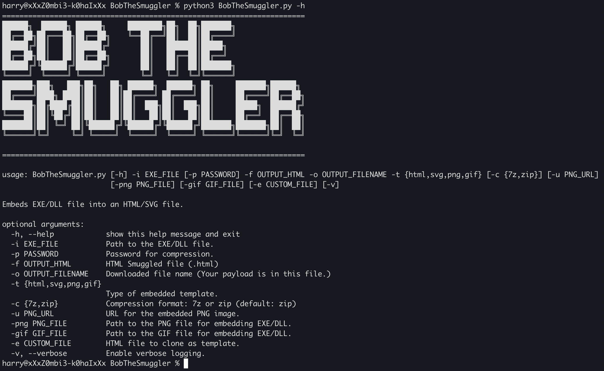
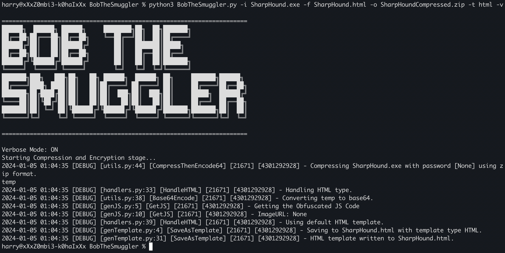
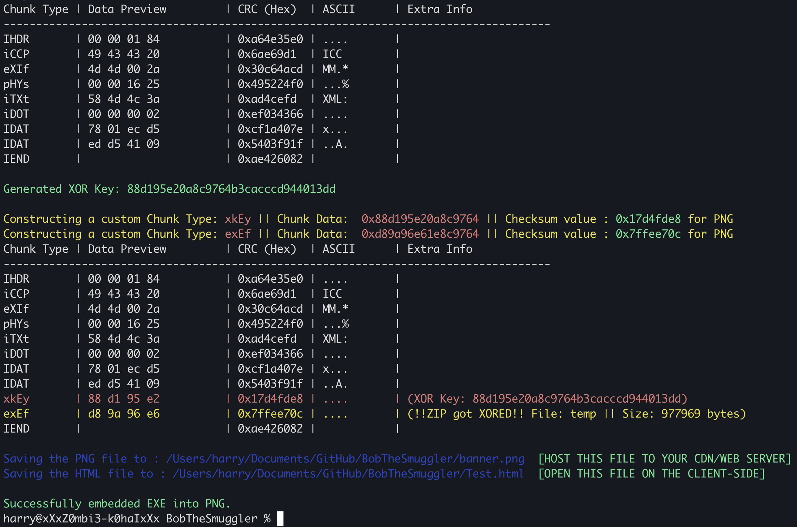
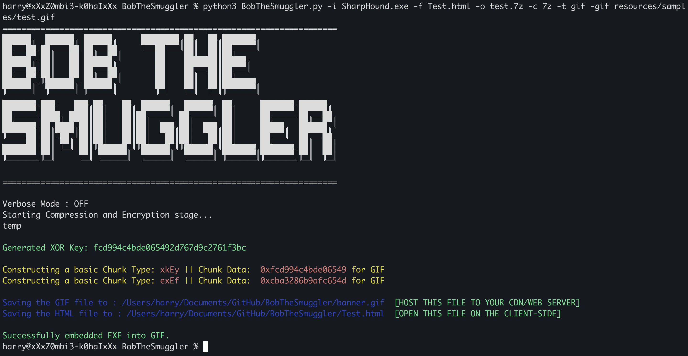
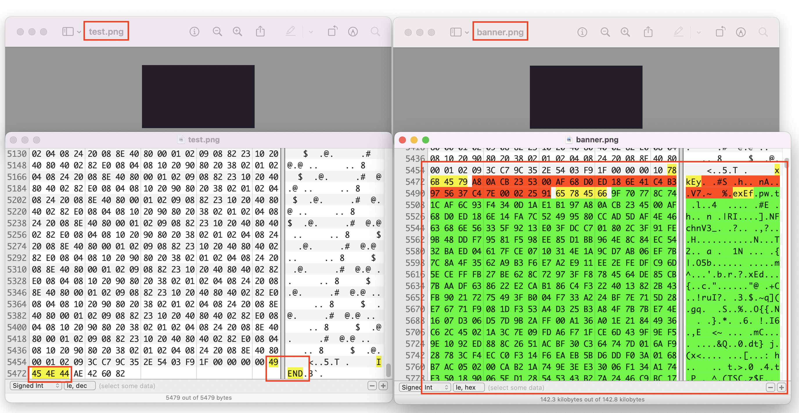
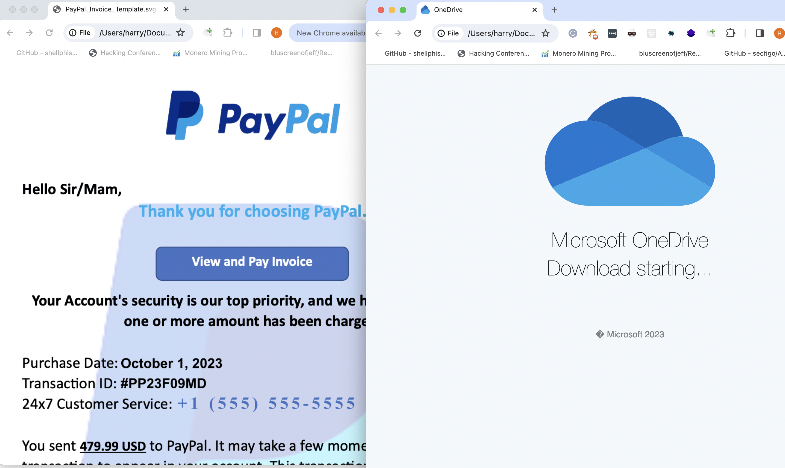

<div align="center">

  
  
  [](https://twitter.com/TheCyb3rAlpha)
  [](https://github.com/TheCyb3rAlpha/BobTheSmuggler)
  


</div>

# BobTheSmuggler


## Quick Update
_Jan 15th, 2024 - **Support for multi-file compression has been added**. If you have multiple files generated for your final payload (e.g., DLL-Sideloading files or multi-stage delivery files), you can now use the '-i' option to specify the directory path. If a directory path is provided, BobTheSmuggler will automatically archive all the files in that directory, XOR encrypt the archive, and embed it inside PNG/GIF._

## Project Description

Check out my blog to get a thorough understanding of how to use this tool: [BobTheSmuggler: Your Covert Cyber Swiss Knife for Undetectable Payload Delivery](https://medium.com/@TheCyb3rAlpha/bobthesmuggler-your-covert-cyber-swiss-knife-for-undetectable-payload-delivery-bc84f3037522).

**"Bob the Smuggler"** is a tool that leverages HTML Smuggling Attack and allows you to create HTML files with embedded 7z/zip archives. The tool would compress your binary (EXE/DLL) into 7z/zip file format, then XOR encrypt the archive and then hides inside PNG/GIF image file format (Image Polyglots). The JavaScript embedded within the HTML will download the PNG/GIF file and store it in the cache. Following this, the JavaScript will extract the data embedded in the PNG/GIF, assemble it, perform XOR decryption, and then store it as an in-memory blob.


This tool currently support the following payload Delivery Chains:

- .EXE/.DLL --> .7z/.Zip (Password Protected) --> .JS --> .HTML
- .EXE/.DLL --> .7z/.Zip (Password Protected) --> .JS --> .SVG --> .HTML
- .EXE/.DLL --> .7z/.Zip (Password Protected) --> .PNG/.GIF --> .JS --> .HTML
- .EXE/.DLL --> .7z/.Zip (Password Protected) --> .PNG/.GIF --> JS --> .SVG --> .HTML

## Key Features
- **Stealthy File Concealment:** Embed any file type (EXE/DLL) securely within HTML pages, PNG, GIF, and SVG files, ensuring the data remains hidden in plain sight.
- **Versatile Embedding:** Offers the flexibility to embed files in various formats, catering to diverse needs and scenarios.
- **Advanced Obfuscation:** Utilizes sophisticated techniques to obfuscate the embedded data, further enhancing security and reducing detectability.
- **Custom Template Support:** Allows the use of custom HTML and SVG templates for embedding, providing personalized and context-specific concealment.
- **Intuitive Interface:** Features an easy-to-use command-line interface, making it accessible for both technical and non-technical users.
- **Visual Validation:** Includes visualization tools for PNG files, offering users a way to confirm the successful embedding of data.

## Pre-requisites

Before running the tool, you need the following pre-requisites:

```
pip install python-magic py7zr pyminizip
```

**Note:** To install python-magic, you would need to install the libmagic library on your system. Follow this URL to install the libmagic library: https://pypi.org/project/python-magic/

## Installation

Once the required libraries are installed, you can proceed with the installation of the tool using the following commands:

```
git clone https://github.com/TheCyb3rAlpha/BobTheSmuggler.git
cd BobTheSmuggler
```

## Usage

Once installed, you can use the tool by executing the following command:
```
python3 BobTheSmuggler.py -h
```



```
======================================================================
██████╗  ██████╗ ██████╗     ████████╗██╗  ██╗███████╗
██╔══██╗██╔═══██╗██╔══██╗    ╚══██╔══╝██║  ██║██╔════╝
██████╔╝██║   ██║██████╔╝       ██║   ███████║█████╗
██╔══██╗██║   ██║██╔══██╗       ██║   ██╔══██║██╔══╝
██████╔╝╚██████╔╝██████╔╝       ██║   ██║  ██║███████╗
╚═════╝  ╚═════╝ ╚═════╝        ╚═╝   ╚═╝  ╚═╝╚══════╝
███████╗███╗   ███╗██╗   ██╗ ██████╗  ██████╗ ██╗     ███████╗██████╗
██╔════╝████╗ ████║██║   ██║██╔════╝ ██╔════╝ ██║     ██╔════╝██╔══██╗
███████╗██╔████╔██║██║   ██║██║  ███╗██║  ███╗██║     █████╗  ██████╔╝
╚════██║██║╚██╔╝██║██║   ██║██║   ██║██║   ██║██║     ██╔══╝  ██╔══██╗
███████║██║ ╚═╝ ██║╚██████╔╝╚██████╔╝╚██████╔╝███████╗███████╗██║  ██║
╚══════╝╚═╝     ╚═╝ ╚═════╝  ╚═════╝  ╚═════╝ ╚══════╝╚══════╝╚═╝  ╚═╝
======================================================================

usage: BobTheSmuggler.py [-h] -i EXE_FILE [-p PASSWORD] -f OUTPUT_HTML -o OUTPUT_FILENAME -t {html,svg,png,gif} [-c {7z,zip}] [-u PNG_URL] [-png PNG_FILE] [-gif GIF_FILE] [-e CUSTOM_FILE] [-v]

Hides EXE/DLL file inside an HTML/SVG file.

optional arguments:
  -h, --help            show this help message and exit
  -i EXE_FILE           Path to the EXE/DLL file.
  -p PASSWORD           Password for compression.
  -f OUTPUT_HTML        HTML Smuggled file (.html)
  -o OUTPUT_FILENAME    Downloaded file name (Your payload is in this file.)
  -t {html,svg,png,gif} Type of embedded template.
  -c {7z,zip}           Compression format: 7z or zip (default: zip)
  -u PNG_URL            URL for the embedded PNG image.
  -png PNG_FILE         Path to the PNG file for embedding EXE/DLL.
  -gif GIF_FILE         Path to the GIF file for embedding EXE/DLL.
  -e CUSTOM_FILE        HTML file to clone as template.
  -v, --verbose         Enable verbose logging.
```

## Examples

If you want to compress SharpHound.exe into 7z format (password protected) and store it in a HTML file, you can use the following command:

```
python3 BobTheSmuggler.py -i path/to/SharpHound.exe -p 123456 -c 7z -f SharpHound.html -o SharpHound.7z -t html
```




### Embed payload inside PNG File:
To create an HTML file with the embedded payload hidden inside PNG file, you can use the following command:
```
python3 BobTheSmuggler.py -i <Input_file_path> -p <password_to_encrypt> -f <output_HTML_filename> -o <Output 7z/zip filename stored inside HTML> -t png test.png
```



**NOTE:** Make sure you host the PNG/GIF files on a CDN. (Recommended: You should use the -u option to provide the CDN URL where you'll host the PNG/GIF file). For testing purpose, you can use the flask app (app.py) which would host banner.gif and banner.png on localhost:8000

Similarly, you can use the following command to create an HTML file with the embedded payload hidden inside GIF file:

### Embed payload inside GIF File:
```
python3 BobTheSmuggler.py -i <Input_file_path> -p <password_to_encrypt> -f <output_HTML_filename> -o <Output 7z/zip filename stored inside HTML> -t gif test.gif
```


Once the final image (PNG/GIF) is generated, the size of the image will increase because it will contain your embedded file.



### .EXE/.DLL --> .7z --> .PNG --> .SVG --> .HTML Chain:
A simple chain with a different approach. Your EXE/DLL gets compressed to .7z/.zip file, then it gets stored inside a PNG/GIF file. The PNG/GIF gets called by the JS inside the SVG file which is embedded inside HTML. Once the JS is called, it downloads PNG/ZIP file, extracts XOR'd compressed data from the image chunks, decrypts the file and invokes the download functionality.

```
python3 BobTheSmuggler.py -i <Input_file_path> -p <password_to_encrypt> -f <output_HTML_filename> -o <Output 7z/zip filename stored inside HTML> -t svg -e <Custom_SVG_Template>
```

The Following Templates have been added to this project:
 - **OneDrive Download HTML Template (Used by BumbleBee malware delivery mechanism)**
 - **Paypal Fake Invoice SVG Template (Used for callback phishing)**



## Disclaimer
This tool is intended solely for educational purposes. Users are advised to utilize it only in a manner that promotes learning and understanding. The author of this tool explicitly disclaims any liability for its use beyond educational contexts. Users choosing to employ this tool for purposes other than education do so at their own risk and responsibility, and the author shall not be held accountable for any consequences arising from such use.
